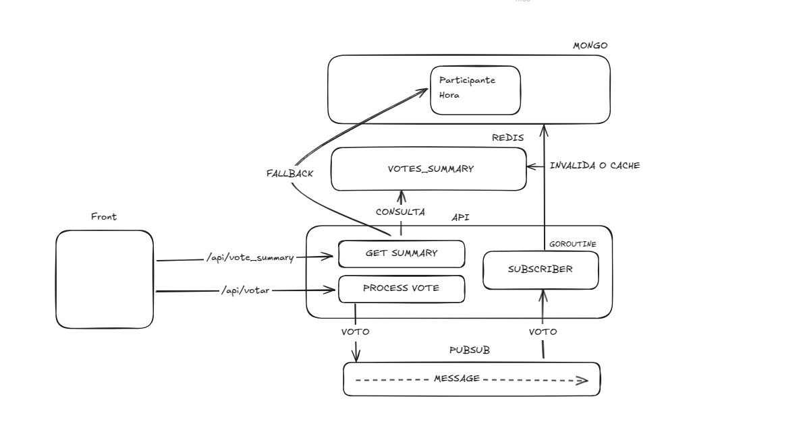

# 📝 API de Votação em Go

API escalável para sistema de votação em eventos, implementando Clean Architecture com padrões modernos de desenvolvimento.

Caso de Uso:

- Os usuários podem votar quantas vezes quiserem independente da opção escolhida, entretanto, a produção do programa não gostaria de receber votos oriundos de uma maquina e sim votos de pessoas
- A votação e chamada em horário nobre, com isso, e esperado um volume elevado de votos. Para exemplificar, vamos trabalhar com 1000 votos/segundo
- A produção do programa gostaria de consulta o total gerado de votos, o total por participante e o total de votos por hora

## Arquitetura(System design)



- Arquitetura Limpa com separação clara de camadas

- Comunicação Assíncrona via RabbitMQ

- Cache distribuído com Redis

- Monitoramento com Prometheus + Grafana

- Resiliência com tratamento adequado de erros

## 🏗 Estrutura do Projeto

```
├── cmd/
│   └── main.go          # Ponto de entrada da aplicação
├── dto/                 # Data Transfer Objects
├── handler/             # Camada de apresentação (HTTP)
├── model/               # Modelos de domínio
├── repository/          # Camada de acesso a dados
├── services/            # Serviços externos (Redis, RabbitMQ)
├── subscriber/          # Consumidores de mensagens
└── usecase/             # Lógica de negócios
```

## 🚀 Como Executar

Pré-requisitos

- Go 1.20+
- Docker e Docker Compose

### Método 1: Local com Docker

```bash
# Iniciar todos os serviços
 docker-compose up -d

# Parar serviços
 docker-compose down
```

### Método 2: Desenvolvimento Local

Caso api não suba no docker pode executar local na sua maquina e o restante pode deixar em container

```bash
# Instalar dependências
 go mod download

# Iniciar aplicação (requer serviços externos rodando)
 go run cmd/main.go
```

## 🔌 Portas e Endpoints

#### Retorna todos os itens

```http
POST http://8000/api/vote
```

| Parâmetro        | Tipo  | Descrição      |
| :--------------- | :---- | :------------- |
| `participant_id` | `int` | Registrar voto |

#### Obter resumo de votos

```http
GET http://8000/api/vote/summary
```

#### Métricas da aplicação Prometheus

```http
http://9090/metrics
```

#### Dashboards Grafana

```http
http://3000
```

#### Management Console RabbitMQ

```http
http://15672
```

## 📊 Monitoramento

- A stack de monitoramento inclui:

- Prometheus - Coleta métricas da aplicação

- Grafana - Visualização de dashboards

- Métricas Customizadas:
  - Total de votos
  - Tempo de resposta
  - Erros por tipo
  - Uso de recursos

## 🔧 Padrões Implementados

- Clean Architecture - Separação clara de responsabilidades

- Repository Pattern - Isolamento da camada de dados

- Pub/Sub - Comunicação assíncrona entre serviços

- CQRS - Separação de leitura e escrita (para o sistema de votos)

- Circuit Breaker - Resiliência em chamadas externas

## 🛠 Melhorias Futuras

- Adicionar documentação Swagger/OpenAPI

- Configurar CI/CD com GitHub Actions

- Implementar feature flags

- Adicionar tracing distribuído (Jaeger)

## License

[MIT](https://choosealicense.com/licenses/mit/)
